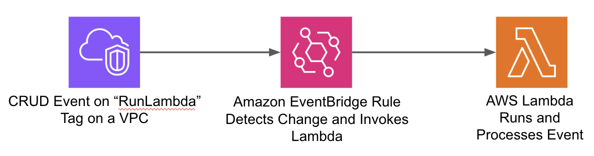

# Running a Lambda Function after a VPC is tagged with a specific Key, Value Pair

A simple example of an EventBridge Rule to invoke a very simple Lambda Function when a specific Tag is Created, Updated, or Deleted on a VPC.

## Deploying the Resources

This deployment is based on a simple terraform plan. The terraform produces the following items:

* IAM Role for the Lambda Function to use.
* Lambda Function
* EventBridge Rule with Lambda as Target
* VPC (with the `RunLambda` tag)

To deploy this terraform just initiate the normal terraform steps:

1. Run `terraform init`

2. Run `terrafrom apply`, and type `Yes` when prompted to complete the deployment.

## Testing the Deployment

Once completed just Edit or Delete the the `RunLambda` tag on the VPC, and change in the value will result in the Lambda Function executing.

You can review the results of the Lambda execution in the CloudWatch Logs.

## Removing the Resources

Once you've completed your testing you can remove the resources in the normal way by running `terraform destroy` and entering `Yes`. 
